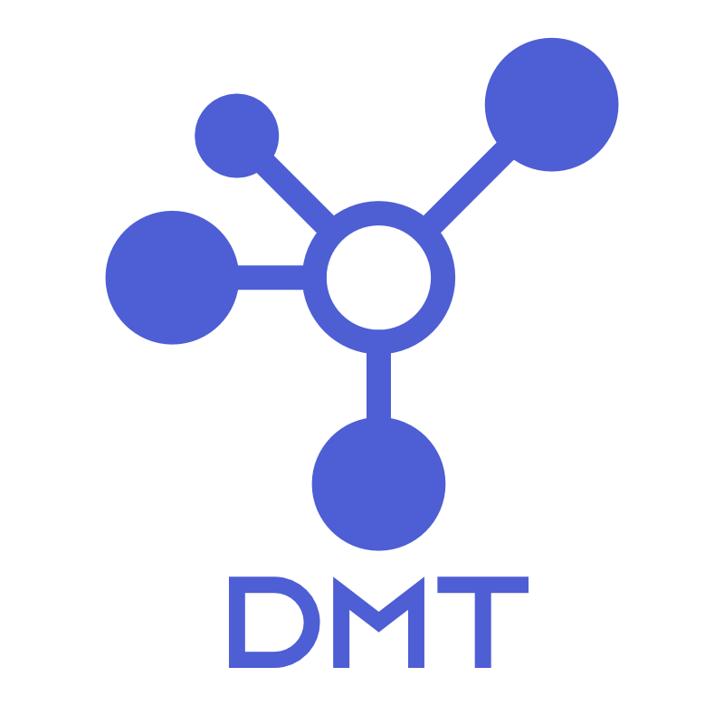

# DMT-core

[](https://docs.python.org/3.8/)
[](https://gitlab.com/dmt-development/dmt-core/-/pipelines)
[](https://gitlab.com/dmt-development/dmt-core/-/jobs/artifacts/main/file/htmlcov/index.html?job=test_DMT)
[](https://github.com/psf/black)



DeviceModelingToolkit (DMT) is a Python tool targeted at helping modeling engineers extract model parameters, run circuit and TCAD simulations and automate their infrastructure.

See the [DMT-website](https://dmt-development.gitlab.io/dmt-core/index.html) for further information.

## Installation

After installing python 3.8 or later, simply install the release version using

```bash

    python3 -m pip install DMT-core

```

For more information have a look at our [install guide](https://dmt-development.gitlab.io/dmt-core/installation/install_dmt.html)

### Pull Request Process

1. Ensure any install or build dependencies are removed before the end of the layer when doing a build.
2. If necessary add additional documentation to the new features you implemented.
3. Update the CHANGELOG with your changes and increase the version numbers in the changed files to the new version that this Pull Request would represent. The versioning scheme we use is [SemVer](http://semver.org/).
4. Update the README.md with details of changes to the interface, this includes new environment variables, exposed ports, useful file locations and container parameters.
5. You may assign to merge the Pull Request to one of the owners or maintainers to execute the merge.

## Authors

- M. Müller | Markus.Mueller@semimod.de
- M. Krattenmacher | Mario.Krattenmacher@semimod.de
- P. Kuthe | jarodkuthe@protonmail.com

### Contributing

More contributors and merge-requests are always welcome. When contributing to this repository, please first discuss the change you wish to make via issue, email, or any other method with the owners of this repository before making a change.

Contact Markus or Mario, if you are interested to join the team permanently.

### Pull Request Process

1. Ensure any install or build dependencies are removed before the end of the layer when doing a build.
2. If necessary add additional documentation to the new features you implemented.
3. Update the CHANGELOG with your changes and increase the version numbers in the changed files to the new version that this Pull Request would represent. The versioning scheme we use is [SemVer](http://semver.org/).
4. Update the README.md with details of changes to the interface, this includes new environment variables, exposed ports, useful file locations and container parameters.
5. You may assign to merge the Pull Request to one of the owners or maintainers to execute the merge.

## License

This project is licensed under GLP-v3-or-later
