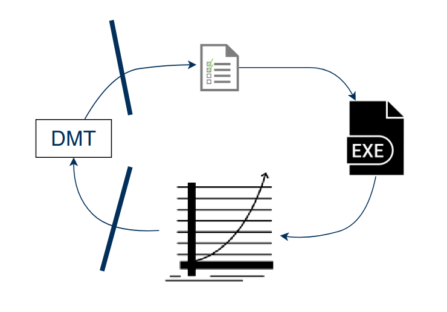
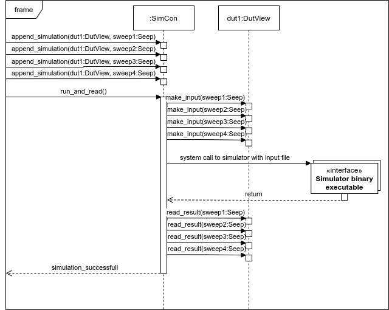

# Statement of need

Semiconductor device engineers are faced by a number of non-trivial tasks that can only be solved efficiently using software. 
These tasks comprise, amongst others, data analysis, visualization and processing, as well as interfacing (different) circuit simulators, TCAD (Technology-Computer-Aided-Design). 
Different hardly documented, but ultimately similar scripts are often employed for solving above-mentioned tasks.
It is not uncommon that fundamental concepts of software engineering, such as TDD (Test-Driven-Development) [@Shull2010] or the use of state-of-the-art version control tools and practices (Git, CI), are not adhered to by these scripts. 
This causes severe in-efficiencies w.r.t. to money and time.

The issues can be summarized as follows:

* The analysis/visualization/generation of data becomes difficult to re-produce
* Device engineers work far from their maximum work-efficiency, as they are hindered, instead of empowered, by the used software infrastructure.
* Knowledge build-up for decades may fade away when people leave a given company or institute

Device Modeling Toolkit (`DMT`) aims to bring an end to this far from ideal situation. 
`DMT` provides a Python library that offers 

* classes and methods relevant for day-to-day device engineering tasks, 
* several abstract base classes useful for implementing new interfaces, e.g. to circuit simulators and 
* concrete implementations of the abstract base classes for open-source simulators such as Ngspice [@Vogt2022], Xyce [@Keiter2021] or Hdev [@Hdev].

In the future, it is planed to also offer some infrastructure for compact model parameter extraction.
Basic principles of software engineering, such as unit testing, version control and a well maintained documentation are provided, so that others can also use and contribute to the software. 

# Summary

`DMT` is implemented as a toolkit that heavily leverages principles ob object-oriented software design. Its Git project contains documentation, CI jobs that execute 
unit and integration tests and also creates ready to install wheel files.  This enables a large community of engineers to install, use and contribute. 

Data inside `DMT` is stored using `DataFrame` objects. 
These are derived from the `pandas.DataFrame` [@McKinney2010] class, ideally suited to process and analyze large amounts of data. 
`DMT` extends this class with several useful data-processing methods that are particularly useful for electrical quantities such as currents, voltages and charges. 
Some of these methods are based on routines in `scikit-rf` [@Arsenovic2022]. 

Data may come from diverse sources like measurements or circuit simulations. 
A central problem is the naming of columns in the data, which should be consistent throughout the code. 
For example, some people might abbreviate the collector current of a bipolar transistor as $\textbf{I\_C}$, while others might write $\textbf{IC}$ instead. 
This may lead to major confusion when exchanging data and code with others.
`DMT` implements a bullet-proof grammar for naming electrical quantities for solving this problem. 
During data import all data columns are translated to this grammar. 

`DMT` offers classes and methods which can be used either directly or need to be subclassed, i.e. for creating interfaces to circuit simulators. 

The base class offered by `DMT` to represent devices is called `DutView` (Device-Under-Test). 
This abstract class provides common attributes and methods for devices that represent measurements, circuit simulations or TCAD simulations. 
There are several subclasses that further add logic:

* `DutMeas` represents a DUT that is based on measured data.
* `DutCircuit` is an abstract class that represent a DUT based on circuit simulation. In DMT-core the interface is implemented for:
  * Xyce [@Keiter2021] in `DutXyce` and
  * Ngspice [@Vogt2022] in `DutNgspice`
* `DutTCAD` is an abstract class that represents a DUT based on TCAD simulation. The interface is implemented for:
  * Hdev [@Hdev] in `DutHdev`

The interface to other simulators, i.e. proprietary ones, is straight forward to implement.
All simulators can be used as drop-in replacements for each other. 
There are two necessary steps that need to be implemented for each simulator. 
First, a routine for generating the simulator input file must be implemented. Second, an import routine that returns a `DataFrame` must be provided. 
This is illustrated in \autoref{fig:interface}. 

{width=50%}

{width=50%}

Often one needs to handle many different devices, e.g. transistors with different geometry on a given test chip. 
For this purpose the `DutLib` class offers a "container" for `DutView` objects, e.g. to store measurement data of one wafer. 
A typical use case is the read-in of measurement data generated for a given technology, including specific test structures and transistors. 

Simulations of circuit and TCAD simulators are managed by the `SimCon` class.
It allows to run many simulations in parallel and utilize the high core count many modern computers. 
Each simulation requires one `DutView` object that defines either a circuit or TCAD simulation, as well as the definition of a sweep for changing the operating point. 
The definition of sweeps, i.e. the sweep of voltages or currents, is controlled by objects of the `Sweep` class. 
`SimCon` generates a hash for every simulation so that simulations need not be run when the software is called multiple times, provided the simulation (and therefore the hash) have not changed.

Another important class is `MCard`. It is useful to store the model parameters of compact models that are defined within Verilog-A files. 
It implements a container to store all those parameters, including information on parameter boundaries that is directly obtained from Verilog-A source files. 
This feature leverages the VerilogAE tool [@Kuthe2020a].
`MCard` can interpret Verilog-A model codes, save and load lists of model parameters and also be used to define elements in the `Circuit` class used for defining circuit simulations. 

Finally, `DMT` implements the `Plot` class for displaying electrical data using different back-ends: 

* `matplotlib` for interactive plots
* `pyqtgraph` for plots to be used in GUI applications 
* `LaTeX:pgfplots` for TeX based technical documentation or scientific publications

# Related Publications

`DMT` is used internally by CEDIC staff in research and by SemiMod for commercial purposes. It has also been used by cooperating institutions and companies. 
The project has been used in the following publications:

* [@Muller2021]: TCAD simulations and plotting.
* [@Phillips2021]: Model parameter extraction and TCAD simulation.
* [@Weimer2021]: Circuit simulations.
* [@Muller2021a]: Circuit and TCAD simulations.
* [@Muller2020c]: Model parameter extraction.

`DMT` has been mentioned in [@Grabinski2019,@Kuthe2020a,@Muller2019a,@Muller2021b].

# Related Projects

`DMT` directly uses 
the [VerilogAE tool](https://man.sr.ht/~dspom/openvaf_doc/verilogae/) [@Kuthe2020a] for accessing all information in Verilog-AMS files. 
The TCAD simulator [Hdev](https://gitlab.com/metroid120/hdev_simulator) [@Hdev] uses the class `DutHdev` as its Python interface.

# Acknowledgements 

This project would not have been possible without our colleagues Dipl.-Ing. Christoph Weimer and Dr.-Ing. Yves Zimmermann. 
We particularly acknowledge Wladek Grabinski for his efforts to promote the use of open source software in the semiconductor industry.

# References
