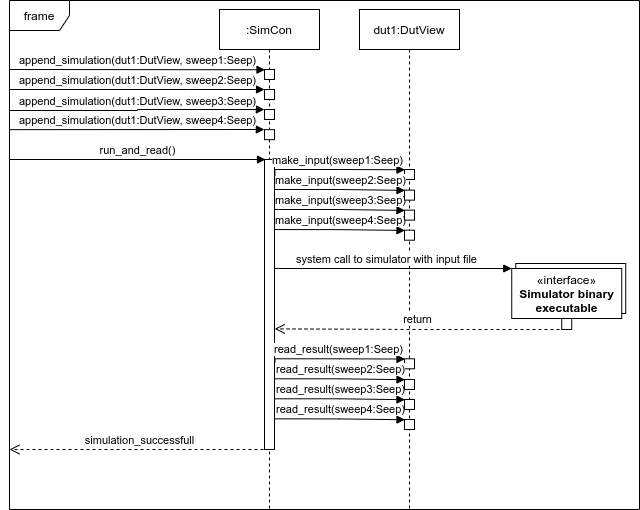

Simulation Controller module
=============================

Class diagram
-------------------------------

.. graphviz:: ../diagrams/classes_sim_con.dot

Sequenz for many simulations in parallel
----------------------------------------

   This Sequenz diagram shows how to use SimCon to run many simulations in parallel.

Module documentation
------------------------------

.. automodule:: DMT.core.sim_con
    :members:
    :undoc-members:
    :show-inheritance:
