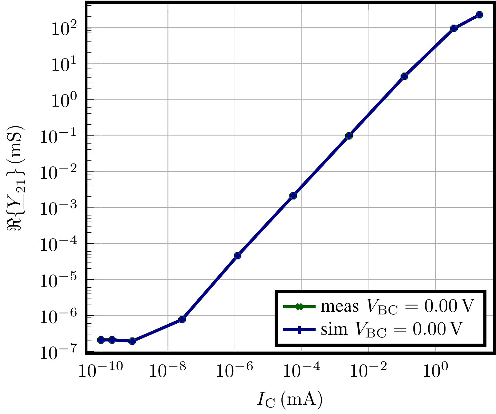

.. _intro:

Introduction
=============

This page provides a brief introduction on the basic workflow and classes used in ``DMT``. 
The focus of this guide is the ``core`` (:ref:`DMT.core <dmt_core>`). module of DMT, the only publicly available module at this time. 
The goal of this intro is to compare measured data to simulation results of a 
Spice-Gummel-Poon compact model. 

Any ``DMT`` scripts begins with the import of the modules and classes that are needed for the use case at hand. 
For simplicity, we will import the full core module and also define a path to the folder where our data is located:

.. code-block:: python

    from pathlib import Path
    from DMT import core
    path_data = Path(__file__).resolve().parent / "_static" / "intro"

The source code of this example is available in the Gitlab repository 
`here <https://gitlab.com/dmt-development/dmt-core/-/tree/main/doc/source/examples/introduction.py>`__

Read Measurement Data
---------------------

First, lets import measurement data from a  ``.csv``-File. The file has the following structure and represents 
typical measurement data of a bipolar transistor at 300 K in common-emitter configuration. 
At each DC operation point an AC-data at two frequencies is available. 
Pay attention to the the inconsistent naming of the columns. 
Keeping the names of electrical quantities consistent is an issue that is handled by DMT during read-in, as will be shown next.

.. csv-table:: Measurement data at 300 K
    :file: _static/intro/meas_data_300K.csv
    :header-rows: 1

Electrical measurement data is not useful if information on the device that has been measured is not available. 
Therefore, data in ``DMT`` is stored in objects that represent an electron device, this could be for example a diode, MOSFET or BJT.
The code below shows how to define a DUT (device-under-test) object which represent an electron device. 
The object can then be used to import measurement data in different formats (e.g. csv, mdm...) as shown below:

.. code-block:: python

    dut_meas = core.DutMeas(
        database_dir=None, # Use dir from config
        dut_type=core.DutType.npn, # it is a BJT-npn
        width=float(1e-6),
        length=float(2e-6),
        name="dut_meas_npn", # name and width/length for documentation
        reference_node="E", # defines configuration
    )
    dut_meas.add_data(path_data / "meas_data_300K.csv", key="300K/iv")

After read-in, the measurement data is available as a so called ``DataFrame`` (:ref:`DMT.core.DataFrame <data_frame>`) object. 
All ``DataFrame`` objects corresponding to a DUT can be accessed using a key that is generated by default as <measurement temperature>/<measurement data file name>.

As mentioned earlier, the data columns of the measurement data need to be converted to a unified format, so that it can be used within 
the software in a unified way. 
The clean up the data-columns, the code below is used. 

.. code-block:: python

    dut_meas.clean_data(fallback={"E_": "E"})

The ``clean_data`` method capitalizes all columns and respects the fallback dictionary as described in the method documentation. 
Hence, the column ``I_E_`` is converted to ``I_E``. 
All column names are converted into ``SpecifierStr`` (:ref:`DMT.core.naming <naming>`) objects that exactly specify 
the type of data in each column. 

After cleaning up, the data has the following columns:

.. code-block:: python

    dut_meas.data["300K/iv"].columns
    > Index(
        ['V_C', 'V_E', 'V_B', 'I_E', 'I_C', 'I_B', 'FREQ', 'Y_CB', 'Y_BB', 'Y_CC', 'Y_BC'],
        dtype='object'
     )

The  ``SpecifierStr`` objects are displayed and can be used exactly like regular strings but have some useful attributes and methods. 
The Y-parameters are translated to "standardized" Y-parameters that use the node names of the DUT instead of numeric indices, as the parameters 
would else depend on the contact configuration of the DUT as a two-port during measurement.
Later, we will demonstrate the generation of ``SpecifierStr`` objects.

Preparing a Simulation
----------------------

For running a simulation of an BJT different things are needed:

* a circuit simulator,
* a compact model (either build-in to the simulator or as Verilog-A code),
* model parameters,
* a circuit definition,
* and finally operation point definitions (temperature, applied voltages and frequencies).

First, we read-in the model as defined in a Verilog-A source file:

.. code-block:: python

    modelcard = core.MCard(
        ["c", "b", "e", "s"],
        "QSGP1",
        core.circuit.SGP_BJT,
        1.0,
        va_file=path_data / "sgp_v1p0.va",
    )

The ``MCard`` object now holds some information on the compact model, amongst which is 
the subcircuit name of the model and the location of its Verilog-A code. 
Using `verilogae <https://man.sr.ht/~dspom/openvaf_doc/verilogae/>`__ the model source file is read and its model parameters 
are collected. 

Usually the model parameters of a given technology are stored in separate files, which can also be read-in with ``DMT``. 
For this purpose the following code can be used, where "bjt.lib" is an exemplary file that stores model parameters of our SGP model:

.. code-block:: python

    modelcard.load_model_parameters(path_data / "bjt.lib")

Next, we need to define a circuit for simulating our DUT using the circuit simulator, this is a bit tricky. 
There are two options

    * define a circuit explicitly

    * overwrite the  abstract ``MCard.get_circuit`` method and pass the modelcard directly into our simulator interface. 

Here, we will use the second option. 
The ``MCard.get_circuit`` method is abstract so that one may create subclasses representing compact models that are used often. 

Instead of creating a subclass, we will simply overwrite the method in this tutorial.
So let us define the method that creates a circuit using the DUT information:

.. code-block:: python

    def get_circuit(self):
        """Returns a circuit which uses the modelcard to which the method is attached.

        Returns
        -------
        circuit : :class:`~DMT.core.circuit.Circuit`

        """
        circuit_elements = []
        # model instance
        circuit_elements.append(
            core.circuit.CircuitElement(
                self.default_module_name,
                self.default_subckt_name,
                [f"n_{node.upper()}" for node in self.nodes_list],
                # ["n_C", "n_B", "n_E"],
                parameters=self,
            )
        )

        # BASE NODE CONNECTION #############
        # shorts for current measurement
        circuit_elements.append(
            core.circuit.CircuitElement(core.circuit.SHORT, "I_B", ["n_B_FORCED", "n_B"])
        )
        # COLLECTOR NODE CONNECTION #############
        circuit_elements.append(
            core.circuit.CircuitElement(core.circuit.SHORT, "I_C", ["n_C_FORCED", "n_C"])
        )
        # EMITTER NODE CONNECTION #############
        circuit_elements.append(
            core.circuit.CircuitElement(core.circuit.SHORT, "I_E", ["n_E_FORCED", "n_E"])
        )
        # add sources
        circuit_elements.append(
            core.circuit.CircuitElement(
                core.circuit.VOLTAGE,
                "V_B",
                ["n_B_FORCED", "0"],
                parameters=[("Vdc", "V_B"), ("Vac", "V_B_ac")],
            )
        )
        circuit_elements.append(
            core.circuit.CircuitElement(
                core.circuit.VOLTAGE,
                "V_C",
                ["n_C_FORCED", "0"],
                parameters=[("Vdc", "V_C"), ("Vac", "V_C_ac")],
            )
        )
        circuit_elements.append(
            core.circuit.CircuitElement(
                core.circuit.VOLTAGE,
                "V_E",
                ["n_E_FORCED", "0"],
                parameters=[("Vdc", "V_E"), ("Vac", "V_E_ac")],
            )
        )

        # metal resistance between contact emitter potential and substrate contact
        circuit_elements.append(
            core.circuit.CircuitElement(
                core.circuit.RESISTANCE, "R_S", ["n_S", "n_E_FORCED"], parameters=[("R", str(0.5))]
            )
        )

        # some variables used in this circuit
        circuit_elements += [
            "V_B=0",
            "V_C=0",
            "V_E=0",
            "ac_switch=0",
            "V_B_ac=1-ac_switch",
            "V_C_ac=ac_switch",
            "V_E_ac=0",
        ]

        return core.circuit.Circuit(circuit_elements)

This circuit connects voltage sources to all terminals of the DUT except the substrate node. 
The sources are connected using shorts in series to the terminals for measuring the terminal currents. 
This approach is used for all circuit simulators in ``DMT`` for having a unified interface that works in all circuit simulators. 

For binding the method to our modelcard, the ``types`` module of Python is required:

.. code-block:: python

    import types

    modelcard.get_circuit = types.MethodType(get_circuit, modelcard)

In this example, we will use the circuit simulator Xyce. 
The circuit is represented by another DUT object that corresponding to the circuit simulator: 

.. code-block:: python

    from DMT.xyce import DutXyce
    dut_sim = DutXyce(
        None,
        core.DutType.npn,
        modelcard,
        nodes="C,B,E",
        reference_node="E",
    )

This object uses the ``get_circuit`` method that we have defined previously for the modelcard for 
generating a circuit. 

For defining the operating point conditions of the simulation, we will create a ``Sweep`` object, next. 
Conveniently, the ``DataFrame`` object provides a method that automatically creates the sweep definition from its content: 

.. code-block:: python

    sweep = core.df_to_sweep(dut_meas.data[key_saved], temperature=300, from_forced=False)

In some cases this will not work, since generating the sweep for arbitrary data is not always possible in an automated way. 
In such a case, do not hesitate to create an `issue on github <https://gitlab.com/dmt-development/dmt-core/-/issues>`__ and 
supply an example of the measurement data. More test data is always welcome.

With Xyce intalled on your computer, we are now ready to run the simulation:

.. code-block:: python

    sim_con = core.SimCon()
    sim_con.append_simulation(dut=dut_sim, sweep=sweep)
    sim_con.run_and_read()

Accessing the Data and Plotting
-------------------------------

Now the data is simulated and ready to use. 
Next, we will show how to access and add more data to the ``DataFrame``, before finally plotting it in a suitable way for documentation or publications.

We now have measurement and simulation data:

.. code-block:: python

    data_meas = dut_meas.data[key_saved]
    data_sim = dut_sim.get_data(sweep=sweep)

The measurement data is accessed using the key that was defined during read-in, e.g. <temperature in K>/<measurement data file name>. 
For simulations, ``DMT`` creates a MD5-hash for every sweep that is part of the key. 
During simulation, a folder is created under <DMT simulation directory>/<DUT MD5 Hash>/<Sweep MD5 Hash>, in which the simulation is run. 

Now, let us access the different columns inside the ``DataFrame`` instances and demonstrate the ``SpecifierStr`` class capabilities. 
First, let's create some column names:

.. code-block:: python

    col_vbe = core.specifiers.VOLTAGE + ["B", "E"]
    col_vbc = core.specifiers.VOLTAGE + ["B", "C"]
    col_ic = core.specifiers.CURRENT + "C"
    col_freq = core.specifiers.FREQUENCY
    col_ft = core.specifiers.TRANSIT_FREQUENCY
    col_y21_real = core.specifiers.SS_PARA_Y + ["C", "B"] + core.sub_specifiers.REAL

These column names can then be used to add the voltages, 
the transit frequency and the real part of y_21 to the ``DataFrame`` instances. 
As all column names follow the same format, every ``DataFrame`` instance can be treated in exactly the same way, 
which is really convenient. 

.. code-block:: python
    
    for dut, data in zip([dut_meas, dut_sim], [data_meas, data_sim]):
        data.ensure_specifier_column(col_vbe)
        data.ensure_specifier_column(col_vbc)
        data.ensure_specifier_column(col_ft, ports=dut.ac_ports)
        data.ensure_specifier_column(col_y21_real, ports=dut.ac_ports)

Next, we define some plots using the ``Plot`` class:

.. code-block:: python

    plt_ic = core.Plot(
        plot_name="I_C(V_BE)",
        x_specifier=col_vbe,
        y_specifier=col_ic,
        y_scale=1e3,
        y_log=True,
        legend_location="lower right",
    )
    plt_y21 = core.Plot(
        plot_name="Y_21(I_C)",
        x_specifier=col_ic,
        x_scale=1e3,
        x_log=True,
        y_specifier=col_y21_real,
        y_scale=1e3,
        y_log=True,
        legend_location="lower right",
    )
    plt_ft = core.Plot(
        plot_name="F_T(I_C)",
        x_specifier=col_ic,
        x_scale=1e3,
        x_log=True,
        y_specifier=col_ft,
        legend_location="upper left",
    )

Again the specifiers are used, this time for formatting electrical quantities as human-readable strings. 
Let us add data to the plots:

.. code-block:: python

    import numpy as np

    for source, data in zip(["meas", "sim"], [data_meas, data_sim]):
        for i_vbc, vbc, data_vbc in data.iter_unique_col(col_vbc, decimals=3):
            data_freq = data_vbc[np.isclose(data_vbc[col_freq], 1e7)]
            plt_ic.add_data_set(
                data_freq[col_vbe],
                data_freq[col_ic],
                label=source + " " + col_vbc.to_legend_with_value(vbc),
            )
            plt_y21.add_data_set(
                data_freq[col_ic],
                data_freq[col_y21_real],
                label=source + " " + col_vbc.to_legend_with_value(vbc),
            )
            plt_ft.add_data_set(
                data_freq[col_ic],
                data_freq[col_ft],
                label=source + " " + col_vbc.to_legend_with_value(vbc),
            )

This piece of code also uses the specifiers and the data handling capabilities ``DMT`` offers. But here are multiple things to unpack:

#. the ``zip`` is used again to handle the both frames the same way.
#. ``DataFrame.iter_unique_col`` allows to iterate over parts of the data where a specific column is unique. 
#. In the next line, Pandas indexing is used together with a numpy filter. This way one can easily select the rows of the data.
#. The correct columns are added to the plots using the specifiers from above.
#. ``SpecifierStr`` instances offer many methods for pretty printing. The shown variant here, includes all of them at once. The variable is pretty printed together with a value with a possibly scaled unit.

To have a look at the plots we can use different back-ends. ``pyqtgraph`` is the fastest:

.. code-block:: python

    plt_ic.plot_pyqtgraph(show=False)
    plt_y21.plot_pyqtgraph(show=False)
    plt_ft.plot_pyqtgraph(show=True)

Additionally it is quite easy to export the plots ready for documentations or scientific publications:

.. code-block:: python

    plt_ic.save_tikz(path_data, standalone=True, build=True, clean=True, width="3in")
    plt_y21.save_tikz(path_data, standalone=True, build=True, clean=True, width="3in")
    plt_ft.save_tikz(path_data, standalone=True, build=True, clean=True, width="3in")

The plots look like this:

.. image:: _static/intro/I_CV_BE.png
    :alt: Collector current versus base-emitter voltage for measurement and simulation.

.. image:: _static/intro/F_TI_C.png
    :alt: Transfer frequency versus collector current for measurement and simulation.

Note that the Y-Parameters are converted back to the traditional way of expressing Y-parameters using the contact configuration stored in 
the DUT instances. 

Here, we have used simulated data in place of measurement data. Therefore, no difference is visible between the two lines in the graphs. 
In the device modeling community data sharing is, unfortunately, difficult. 

Do not hesitate to reach out if you have questions or issues with ``DMT``. 
Also if you are missing a feature you would like to see in future releases of ``DMT``, 
you are welcome to create a feature request in the Gitlab repository or implement it yourself and create a merge request!